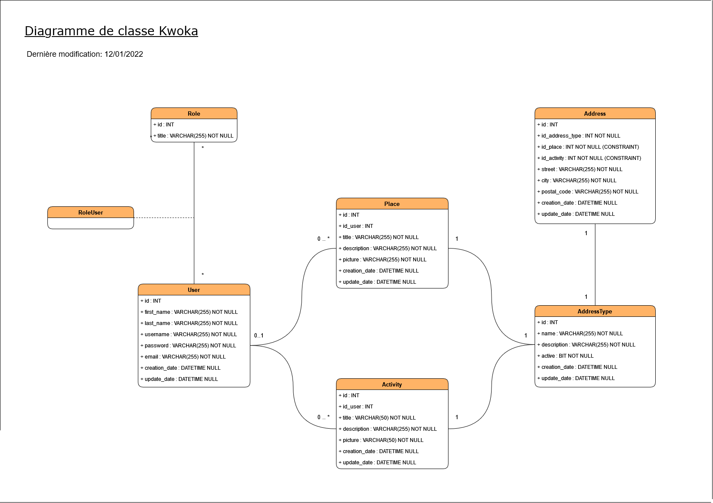

Projet **Symfony 5** réalisé en cours de formation MBA Développeur Fullstack à MyDigitalSchool

## Description

Il s'agit de la partie back-end (API) du projet Kwoka réalisé lors de la formation MBA Développeur Fullstack à MyDigitalSchool.

L'API a été réalisée avec le framework PHP [Symfony](https://symfony.com/) qui est un ensemble de composants PHP basé sur le modèle d'architecture logicielle MVC (Modèle, Vue, Controlleur),
en lien avec l'outil [ApiPlatform](https://api-platform.com/) étant une librairie puissante et moderne permettant la création d'APIs REST de façon simple et rapide.

## Architecture

### Diagramme de classe

## Accès en ligne

* Accès au site web Kwoka: [WIP]
* Accès à l'API Kwoka: https://mds-kwoka-api.herokuapp.com/api

## Dependances

* **ApiPlatform** - Librairie permettant la création d'API REST moderne avec Symfony

## Ressources externes

* [Trello](https://trello.com/b/2GEz4fMe/kwoka-back-end) - Outil de gestion de projet agile
* [Swagger](https://mds-kwoka-api.herokuapp.com/api) - Liste de l'ensemble des requêtes prises en charge par l'API (à définir)

## Licence

* **GNU General Public License v3.0** - Voir la [LICENSE](LICENSE) pour plus de détails.
